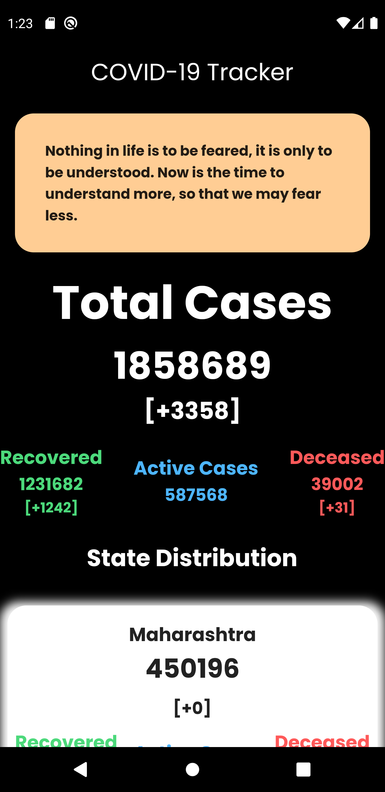

# covid_app

A new Flutter application that tracks and shows the covid cases in india and in its states.

All the data are obtained using diff api of  https://api.covid19india.org/ .

## Screenshots

      
      
      

